Health Tweets Analysis
================
Yihun Zeleke
2020-06-10

## Project idea:

There are different health tweets from different news agencies. This
health tweets from bbc, cbc,and many more. This data is publicly
available on
[Health-New-Tweets.zip](https://archive.ics.uci.edu/ml/machine-learning-databases/00438/)
file.


## Data pre-processing

I will start by reading the all the `16` health tweets from news
agencies.

``` r
library(dplyr)
library(tidyr)
library(purrr)
library(readr)
library(ggplot2)
library(textdata)
theme_set(theme_bw())
```

``` r
# Define a function to read all the files from a folder in to a data frame
data_folder <- "data"

# Define a function to read all files from a folder into a data frame
read_folder <- function(infolder) {
  tibble(file = dir(infolder, full.names = TRUE)) %>%
    mutate(text = map(file, read_lines)) %>%
        unnest(text)
}

# Use unnest() and map() to apply read_folder to each sub folder
raw_text <- tibble(folder = dir(data_folder, full.names = TRUE)) %>%
  mutate(folder_out = map(folder, read_folder)) %>%
  unnest(cols = c(folder_out)) %>%
  transmute(newsgroup = basename(folder), text) %>% 
  separate(text,c("id","date", "text"), sep = "[|]") %>% 
  select(-2) %>% 
  mutate(id = group_indices(., newsgroup)) %>% 
  mutate(date = as.Date(date, "%a %b %d %H:%M:%S %z %Y"))


raw_text
```

    FALSE # A tibble: 63,327 x 4
    FALSE    newsgroup date       text                                                  id
    FALSE    <chr>     <date>     <chr>                                              <int>
    FALSE  1 bbchealth 2015-04-09 Breast cancer risk test devised http://bbc.in/1Ci~     1
    FALSE  2 bbchealth 2015-04-08 GP workload harming care - BMA poll http://bbc.in~     1
    FALSE  3 bbchealth 2015-04-08 Short people's 'heart risk greater' http://bbc.in~     1
    FALSE  4 bbchealth 2015-04-08 New approach against HIV 'promising' http://bbc.i~     1
    FALSE  5 bbchealth 2015-04-08 Coalition 'undermined NHS' - doctors http://bbc.i~     1
    FALSE  6 bbchealth 2015-04-08 Review of case against NHS manager http://bbc.in/~     1
    FALSE  7 bbchealth 2015-04-08 VIDEO: 'All day is empty, what am I going to do?'~     1
    FALSE  8 bbchealth 2015-04-08 VIDEO: 'Overhaul needed' for end-of-life care htt~     1
    FALSE  9 bbchealth 2015-04-08 Care for dying 'needs overhaul' http://bbc.in/1Fd~     1
    FALSE 10 bbchealth 2015-04-07 VIDEO: NHS: Labour and Tory key policies http://b~     1
    FALSE # ... with 63,317 more rows

The `newsgroup` column which describes which of the 16 newsgroups each
tweets comes from. And the `id` column which generated from Tweeter
while `date` is the date of tweets that made by the news agencies and
the `text` column is the tweets from the news agencies.

What news Agencies are included, and how many tweets were posted in
each?

``` r
library(ggplot2)

raw_text %>% 
  group_by(newsgroup) %>%
  count(newsgroup, sort = T) %>% 
  rename(`# tweets` = n) %>% 
   ggplot(aes(newsgroup,`# tweets`))+
  geom_col()+
  coord_flip()
```

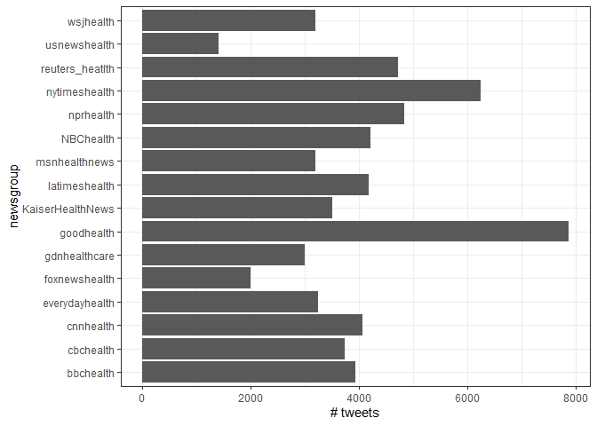<!-- -->

As we from newsgroups `goodhealth` and `nytimeshealth` have higher
tweets than others.

### Pre-processing text

Text pre-processing is more complicated than numerical pre-processing.
So we use different approach for the text pre-processing to ready for
further analysis.

``` r
library(stringr)
library(tidytext)
library(SnowballC)

reg_remove <- "&amp;|&lt;|&gt;"

cleaned_text <- raw_text %>% 
  filter(!str_detect(text,"^RT")) %>%  # RT means Retweet
  mutate(text = str_remove_all(text,reg_remove)) %>% 
  #mutate(text =  str_replace_all(text,"#[a-z,A-Z]*","")) %>%  # removing hashtags
  #mutate(text =  str_replace_all(text,"@[a-z,A-Z]*","")) %>% # removing @
  mutate(text = gsub("\\s?(f|ht)(tp)(s?)(://)([^\\.]*)[\\.|/](\\S*)", "", text)) # Remove https..

cleaned_text  
```

    FALSE # A tibble: 55,656 x 4
    FALSE    newsgroup date       text                                                 id
    FALSE    <chr>     <date>     <chr>                                             <int>
    FALSE  1 bbchealth 2015-04-09 Breast cancer risk test devised                       1
    FALSE  2 bbchealth 2015-04-08 GP workload harming care - BMA poll                   1
    FALSE  3 bbchealth 2015-04-08 Short people's 'heart risk greater'                   1
    FALSE  4 bbchealth 2015-04-08 New approach against HIV 'promising'                  1
    FALSE  5 bbchealth 2015-04-08 Coalition 'undermined NHS' - doctors                  1
    FALSE  6 bbchealth 2015-04-08 Review of case against NHS manager                    1
    FALSE  7 bbchealth 2015-04-08 VIDEO: 'All day is empty, what am I going to do?'     1
    FALSE  8 bbchealth 2015-04-08 VIDEO: 'Overhaul needed' for end-of-life care         1
    FALSE  9 bbchealth 2015-04-08 Care for dying 'needs overhaul'                       1
    FALSE 10 bbchealth 2015-04-07 VIDEO: NHS: Labour and Tory key policies              1
    FALSE # ... with 55,646 more rows

``` r
  health_tweets <- cleaned_text %>% 
  unnest_tokens(word,text, token = "tweets") %>% 
  filter(!word %in% stop_words$word,
         !word %in% str_remove_all(stop_words$word, "'"),
         str_detect(word, "[a-z]")) 
health_tweets
```

    FALSE # A tibble: 323,946 x 4
    FALSE    newsgroup date          id word    
    FALSE    <chr>     <date>     <int> <chr>   
    FALSE  1 bbchealth 2015-04-09     1 breast  
    FALSE  2 bbchealth 2015-04-09     1 cancer  
    FALSE  3 bbchealth 2015-04-09     1 risk    
    FALSE  4 bbchealth 2015-04-09     1 test    
    FALSE  5 bbchealth 2015-04-09     1 devised 
    FALSE  6 bbchealth 2015-04-08     1 gp      
    FALSE  7 bbchealth 2015-04-08     1 workload
    FALSE  8 bbchealth 2015-04-08     1 harming 
    FALSE  9 bbchealth 2015-04-08     1 care    
    FALSE 10 bbchealth 2015-04-08     1 bma     
    FALSE # ... with 323,936 more rows

### Words in newsgroups

Let’s explore common words in the entire dataset.

``` r
health_tweets %>% 
    count(word, sort = TRUE)
```

    FALSE # A tibble: 30,107 x 2
    FALSE    word         n
    FALSE    <chr>    <int>
    FALSE  1 health    4341
    FALSE  2 ebola     3411
    FALSE  3 study     2797
    FALSE  4 cancer    1929
    FALSE  5 care      1430
    FALSE  6 risk      1420
    FALSE  7 drug      1299
    FALSE  8 patients  1207
    FALSE  9 kids      1090
    FALSE 10 heart     1009
    FALSE # ... with 30,097 more rows

Most common words by newsgroup.

``` r
words_by_newsgroup <- health_tweets %>% 
  count(newsgroup, word, sort = TRUE)

words_by_newsgroup
```

    FALSE # A tibble: 83,552 x 3
    FALSE    newsgroup        word        n
    FALSE    <chr>            <chr>   <int>
    FALSE  1 reuters_heatlth  ebola    1241
    FALSE  2 KaiserHealthNews health    929
    FALSE  3 bbchealth        video     813
    FALSE  4 msnhealthnews    study     762
    FALSE  5 gdnhealthcare    #nhs      720
    FALSE  6 nytimeshealth    health    624
    FALSE  7 nprhealth        health    521
    FALSE  8 gdnhealthcare    nhs       519
    FALSE  9 nytimeshealth    ebola     481
    FALSE 10 KaiserHealthNews reports   464
    FALSE # ... with 83,542 more rows

#### Finding tf-idf within newsgroup

We see that the newsgroups to differ in terms of topic and content, and
therefore the frequency of words to differ between them.

``` r
tf_idf <-  words_by_newsgroup %>% 
  bind_tf_idf(word, newsgroup,n) %>% 
  arrange(desc(tf_idf))
tf_idf
```

    FALSE # A tibble: 83,552 x 6
    FALSE    newsgroup        word                          n      tf   idf tf_idf
    FALSE    <chr>            <chr>                     <int>   <dbl> <dbl>  <dbl>
    FALSE  1 gdnhealthcare    #nhs                        720 0.0446   2.77 0.124 
    FALSE  2 everydayhealth   #healthtalk                 335 0.0243   2.77 0.0673
    FALSE  3 gdnhealthcare    nhs                         519 0.0321   2.08 0.0668
    FALSE  4 bbchealth        nhs                         348 0.0212   2.08 0.0442
    FALSE  5 gdnhealthcare    #viewsfromthenhsfrontline   190 0.0118   2.77 0.0326
    FALSE  6 cnnhealth        #getfit                     249 0.0119   2.08 0.0248
    FALSE  7 latimeshealth    #latfit                     205 0.00812  2.77 0.0225
    FALSE  8 KaiserHealthNews cartoon                     218 0.0101   2.08 0.0210
    FALSE  9 foxnewshealth    @newser                      88 0.00750  2.77 0.0208
    FALSE 10 usnewshealth     #usntechchat                 43 0.00719  2.77 0.0199
    FALSE # ... with 83,542 more rows

`gdnhealthcare` newsgroups has highest tf\_idf, so let’s examine to
extract words specific to those topics.

``` r
tf_idf %>% 
  filter(newsgroup %in% c("gdnhealthcare","bbchealth","KaiserHealthNews","wsjhealth","reuters_heatlth")) %>% 
  group_by(newsgroup) %>% 
  top_n(10, tf_idf) %>% 
  ungroup() %>% 
  mutate(word = reorder( word, tf_idf)) %>% 
  ggplot(aes(word, tf_idf, fill = newsgroup))+
  geom_col(show.legend = FALSE)+
  facet_wrap( ~ newsgroup, scales = "free")+
  coord_flip()
```

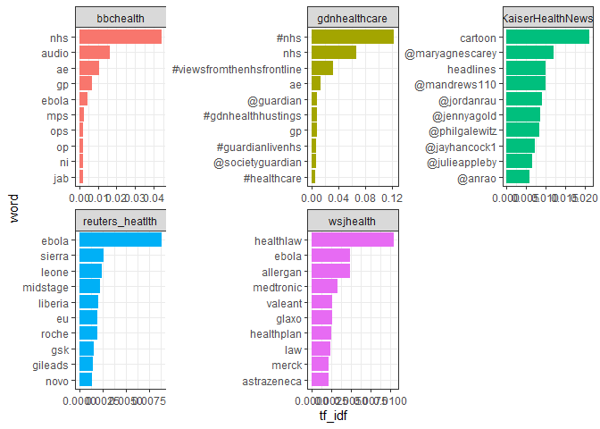<!-- -->

What newsgroups tend to be similar each other in text content? I could
discover this by finding the pairwise correlation of word frequencies
within each newsgroup, using `pairwise_cor()` function.

``` r
library(widyr)

newsgroup_cor <- words_by_newsgroup %>%
  pairwise_cor(newsgroup,  word, n, sort = TRUE)

newsgroup_cor
```

    FALSE # A tibble: 240 x 3
    FALSE    item1           item2           correlation
    FALSE    <chr>           <chr>                 <dbl>
    FALSE  1 nprhealth       nytimeshealth         0.841
    FALSE  2 nytimeshealth   nprhealth             0.841
    FALSE  3 latimeshealth   msnhealthnews         0.809
    FALSE  4 msnhealthnews   latimeshealth         0.809
    FALSE  5 cbchealth       nprhealth             0.807
    FALSE  6 nprhealth       cbchealth             0.807
    FALSE  7 cbchealth       reuters_heatlth       0.776
    FALSE  8 reuters_heatlth cbchealth             0.776
    FALSE  9 cbchealth       nytimeshealth         0.774
    FALSE 10 nytimeshealth   cbchealth             0.774
    FALSE # ... with 230 more rows

Let’s filter stronger correlations among newsgroups, and visualize them
in network diagram.

``` r
library(ggraph)
library(igraph)
set.seed(2015)

newsgroup_cor %>% 
  filter(correlation > 0.4) %>% 
  graph_from_data_frame() %>% 
  ggraph(layout = "fr") +
  geom_edge_link(aes(alpha = correlation, width = correlation))+
  geom_node_point(size = 4, color = "skyblue")+
  geom_node_text(aes(label = name), repel = TRUE)+
  theme_void()
```

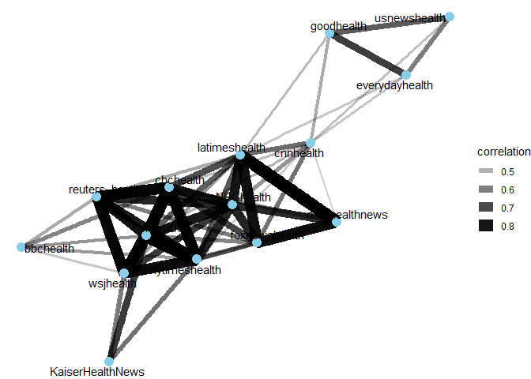<!-- -->

Since the tweets from the same topic the newsgroups are
inter-correlated, even though as we see from the graph it has mainly
three clusters.

## Topic Modeling

The Latent Dirichlet Allocation(LDA) algorithm to divide a set of texts
from from newsgroups that has high tf\_idf frequency that we saw
earlier.

``` r
words_newsgroup <- health_tweets %>% 
  filter(newsgroup %in% c("gdnhealthcare","bbchealth","KaiserHealthNews","wsjhealth")) %>% 
  group_by(word) %>% 
  mutate(word_total = n()) %>% 
  ungroup() %>% 
  filter(word_total > 50) %>% 
  mutate(id =  as.character(id), word_total = as.character(word_total))
  
str(words_newsgroup)
```

    FALSE tibble [20,345 x 5] (S3: tbl_df/tbl/data.frame)
    FALSE  $ newsgroup : chr [1:20345] "bbchealth" "bbchealth" "bbchealth" "bbchealth" ...
    FALSE  $ date      : Date[1:20345], format: "2015-04-09" "2015-04-09" ...
    FALSE  $ id        : chr [1:20345] "1" "1" "1" "1" ...
    FALSE  $ word      : chr [1:20345] "cancer" "risk" "test" "gp" ...
    FALSE  $ word_total: chr [1:20345] "327" "129" "83" "115" ...

Convert into a document-term matrix

``` r
newsgroup_dtm <- words_newsgroup %>% 
  
  unite(document,newsgroup,id) %>% 
  count(document, word) %>% 
  cast_dtm(document,word,n)
```

``` r
library(topicmodels)
newsgroup_lda <- LDA(newsgroup_dtm, k = 4, control = list(seed = 2020))
```

What four topics did this model extract, and did they match the four
newsgroups?

``` r
newsgroup_lda %>% 
  tidy() %>% 
  group_by(topic) %>% 
  top_n(8, beta) %>%
  ungroup() %>% 
  mutate(term = reorder_within(term,beta,topic)) %>% 
  ggplot(aes(term, beta , fill = factor(topic)))+
  geom_col(show.legend = FALSE)+
  facet_wrap( ~  topic, scales = "free_y")+
  coord_flip()+
  scale_x_reordered()
```

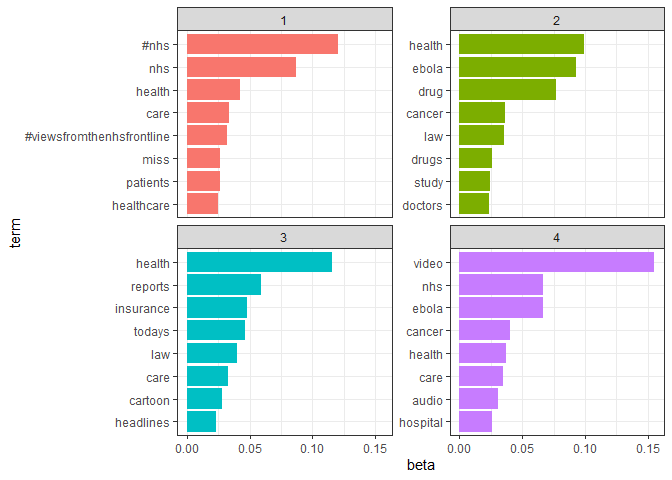<!-- -->

## Sentiment Analysis

Let’s examine how often positive and negative words occurred in the
Health tweet posts. Which newsgroup were the most positive or negative
word overall?

I will use the `afinn` sentiment lexicon, which provides numeric
positivity values for each word, and visualize with a bar plot.

``` r
newsgroup_sentiment <- words_by_newsgroup %>% 
  inner_join(get_sentiments("afinn"), by = "word") %>% 
  group_by(newsgroup) %>% 
  summarise(value = sum(value*n) / sum(n))

newsgroup_sentiment
```

    FALSE # A tibble: 16 x 2
    FALSE    newsgroup          value
    FALSE    <chr>              <dbl>
    FALSE  1 bbchealth        -0.716 
    FALSE  2 cbchealth        -0.793 
    FALSE  3 cnnhealth        -0.263 
    FALSE  4 everydayhealth    0.0506
    FALSE  5 foxnewshealth    -0.575 
    FALSE  6 gdnhealthcare     0.153 
    FALSE  7 goodhealth        0.654 
    FALSE  8 KaiserHealthNews  0.0430
    FALSE  9 latimeshealth    -0.449 
    FALSE 10 msnhealthnews    -0.811 
    FALSE 11 NBChealth        -0.635 
    FALSE 12 nprhealth        -0.434 
    FALSE 13 nytimeshealth    -0.394 
    FALSE 14 reuters_heatlth  -0.539 
    FALSE 15 usnewshealth      0.108 
    FALSE 16 wsjhealth        -0.209

``` r
newsgroup_sentiment %>% 
  mutate(newsgroup = reorder(newsgroup, value)) %>% 
  ggplot(aes(newsgroup, value, fill = value > 0))+
  geom_col(show.legend = FALSE)+
  coord_flip()+
  ylab("Average sentiment value")
```

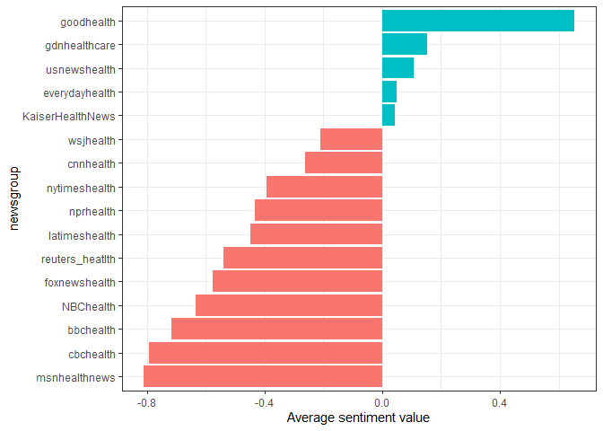<!-- -->

Based on this analysis, the “GoodHealth” newsgroup was the most
positive. This makes sense, since it likely included many positive
adjectives about health news.

### Sentiment analysis by word

It’s worth looking deeper to understand *why* some newsgroups ended up
more positive or negative than others. For that, I can examine the total
positive and negative contributions of each word.

``` r
word_contribution <- health_tweets %>% 
  inner_join(get_sentiments("afinn"), by = "word") %>% 
  group_by(word) %>% 
  summarise(occurrences = n(),
            contribution = sum(value))

word_contribution
```

    FALSE # A tibble: 1,527 x 3
    FALSE    word      occurrences contribution
    FALSE    <chr>           <int>        <dbl>
    FALSE  1 abandon             5          -10
    FALSE  2 abandoned           8          -16
    FALSE  3 abandons            2           -4
    FALSE  4 abduction           3           -6
    FALSE  5 abilities           4            8
    FALSE  6 ability            29           58
    FALSE  7 aboard              2            2
    FALSE  8 absorbed            3            3
    FALSE  9 abuse             119         -357
    FALSE 10 abused             12          -36
    FALSE # ... with 1,517 more rows

``` r
word_contribution %>% 
  top_n(25, abs(contribution)) %>% 
  mutate(word = reorder(word , contribution)) %>% 
  ggplot(aes(word, contribution, fill = contribution > 0))+
  geom_col(show.legend = FALSE)+
  coord_flip()
```

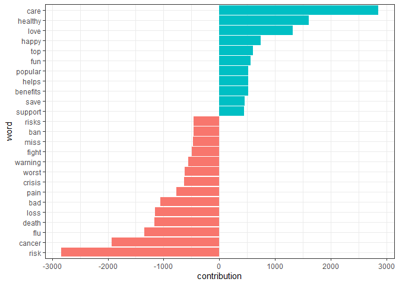<!-- -->

These words seems reasonable as indicators of each tweets sentiment, but
we can spot possible problems with the approach. “Care” could just as
easily be a part of “don’t care” or a similar negative expression, and
the word “Healthy” are apparently very common on the Health-Tweets but
could easily be used in any contexts, positive or negative.

We may also care about which words contributed most with in each
newsgroup, so we can see which newsgroup might be incorrectly estimated.
We can calculate each words’ contribution to each newsgroup’s sentiment
score.

``` r
top_sentiment_words <- words_by_newsgroup %>% 
  inner_join(get_sentiments("afinn"),by = "word") %>% 
  mutate(contribution = value * n / sum(n))

top_sentiment_words %>% 
  filter(newsgroup == "msnhealthnews", contribution < 0) %>% 
  top_n(10, contribution) %>% 
  arrange(desc(contribution))
```

    FALSE # A tibble: 39 x 5
    FALSE    newsgroup     word           n value contribution
    FALSE    <chr>         <chr>      <int> <dbl>        <dbl>
    FALSE  1 msnhealthnews admit          1    -1   -0.0000246
    FALSE  2 msnhealthnews admits         1    -1   -0.0000246
    FALSE  3 msnhealthnews affected       1    -1   -0.0000246
    FALSE  4 msnhealthnews ambivalent     1    -1   -0.0000246
    FALSE  5 msnhealthnews avert          1    -1   -0.0000246
    FALSE  6 msnhealthnews averted        1    -1   -0.0000246
    FALSE  7 msnhealthnews awaits         1    -1   -0.0000246
    FALSE  8 msnhealthnews axe            1    -1   -0.0000246
    FALSE  9 msnhealthnews bias           1    -1   -0.0000246
    FALSE 10 msnhealthnews block          1    -1   -0.0000246
    FALSE # ... with 29 more rows

``` r
top_sentiment_words %>% 
  filter( newsgroup %in% c("goodhealth","gdnhealthcare","msnhealthnews","cbchealth")) %>% 
  group_by(newsgroup) %>%
  top_n(10, abs(contribution)) %>% 
  ungroup() %>% 
  mutate(newsgroup = reorder(newsgroup, contribution),
         word = reorder(paste(word, newsgroup, sep = "_"), contribution)) %>% 
  ggplot(aes(word, contribution, fill = contribution > 0 ))+
  geom_col(show.legend = FALSE)+
  scale_x_discrete(labels = function(x) gsub("_.+","",x))+
  facet_wrap( ~ newsgroup, scales = "free")+
  labs(x = "",
       y = "Sentiment value * # of occurences")+
  coord_flip()
```

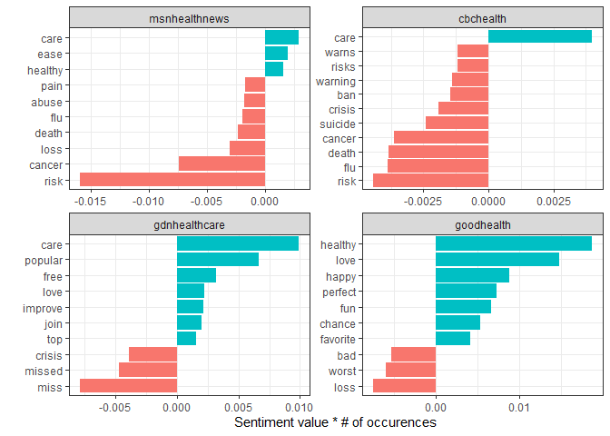<!-- -->

This result support our hypothesis about the “GoodHealth” newsgroup:
must of the sentiments was driven by positive adjectives such as
“healthy”,“love”,“happy”… etc.

As we can see here, the sentiment analysis was confounded by topic, for
example the word “care”,“healthy” ,“love” discussed in different
newsgroups as positive and “risk”,“loss” are discussed as negative which
may require further examine the influential words before interpreting
it.

### N-gram analysis

Let’s take a look the effect of words such as “not” and “no” on the
sentiment analysis.

``` r
tweet_bigram <- cleaned_text %>% 
  unnest_tokens(bigram, text, token = "ngrams", n = 2)

tweet_bigram_counts <- tweet_bigram %>% 
  count(newsgroup, bigram, sort = TRUE) %>% 
  separate(bigram, c("word1", "word2"), sep = " ")
```

We could then define a list of six words that we suspect are used in
negation, such as “no”,“not” and “without” and visualize the
sentiment-associate words that most often followed them. This shows the
words that most often contributed in the “wrong” direction.

``` r
negate_words <- c("not","without","no","can't", "don't", "won't")

tweet_bigram_counts %>% 
  filter(word1 %in% negate_words) %>% 
  count(word1, word2, wt = n, sort = TRUE) %>% 
  inner_join(get_sentiments("afinn"), by = c(word2 = "word")) %>% 
  mutate(contribution = n*value) %>% 
  group_by(word1) %>% 
  top_n(10, abs(contribution)) %>% 
  ungroup() %>% 
  mutate(word2 = reorder(paste(word2, word1, sep = "_"), contribution)) %>% 
  ggplot(aes(word2, contribution, fill = contribution > 0))+
  geom_col(show.legend = FALSE)+
  facet_wrap( ~ word1, scales = "free", nrow = 3)+
  scale_x_discrete(labels =function(x)gsub("_.+$","",x))+
  xlab("Words preceded by a negation")+
  ylab("Sentiment value * # of occurences")+
  theme(axis.text.x = element_text(angle = 45, hjust = 1))+
  coord_flip()
```

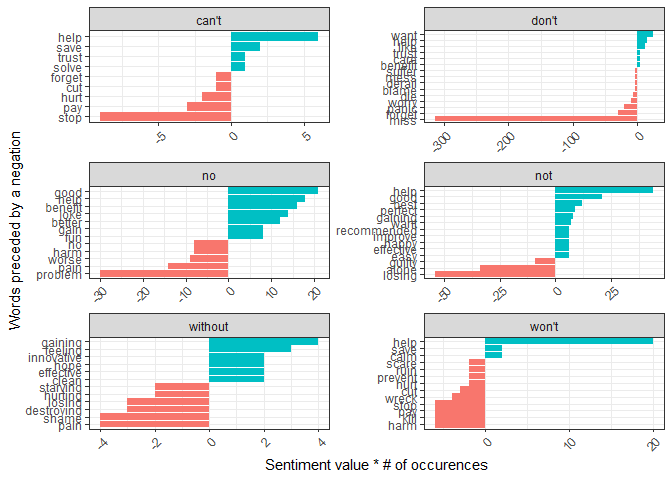<!-- -->

It looks like the largest sources of misidentifying a word as positive
come from “not help/good/perfect”, and the largest source of incorrectly
classified negative sentiment is “don’t miss”.

## Comparing word usage

Since we have 16 newsgroups, I have select two news agencies randomly
*Reuters* and New-*York* health tweets.

``` r
word_ratios <- health_tweets %>% 
  filter(newsgroup %in% c("reuters_heatlth","nytimeshealth")) %>% 
  count(word, newsgroup) %>% 
  group_by(word) %>% 
  filter(sum(n) >= 25) %>% 
  ungroup() %>% 
  spread(newsgroup, n, fill = 0) %>% 
  mutate_if(is.numeric,list(~(.+1) / (sum(.)+1))) %>% 
  mutate(logratio = log(nytimeshealth / reuters_heatlth)) %>% 
  arrange(desc(logratio))

word_ratios %>%
  group_by(logratio < 0) %>%
  top_n(15, abs(logratio)) %>%
  ungroup() %>%
  mutate(word = reorder(word, logratio)) %>%
  ggplot(aes(word, logratio, fill = logratio < 0)) +
  geom_col(show.legend = FALSE) +
  coord_flip() +
  ylab("log odds ratio (New York Times /Reuters )") +
  scale_fill_discrete(name = "", labels = c("New York Times", "Reuters"))
```

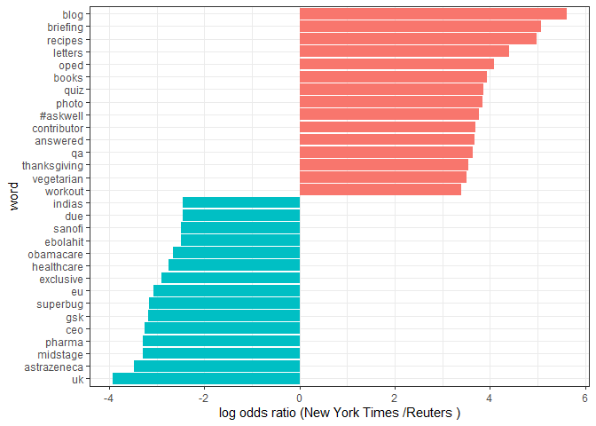<!-- -->

So New York times tweets about “Blog”,“Briefing” on the health tweets,
while Reuters tweets health tweeted about “Uk”, “astrazeneca”, “pharma”.

## Changes in word use

Which words’ frequencies have changed the fastest in our Twitter feeds?
Or Which words have tweeted about at a higher or lower rate as time has
passed?

``` r
library(lubridate)

words_by_time <- health_tweets %>% 
  filter(!str_detect(word,"^@"),
         newsgroup %in% c("reuters_heatlth","nytimeshealth")) %>% 
  #filter(newsgroup %in% c("reuters_heatlth","nytimeshealth")) %>%
  mutate(time_floor = floor_date(date, unit = "1 month")) %>% 
  count(time_floor, newsgroup, word) %>% 
  group_by(newsgroup, time_floor) %>% 
  mutate(time_total = sum(n)) %>% 
  group_by(newsgroup, word) %>% 
  mutate(word_total = sum(n)) %>% 
  ungroup() %>% 
  rename(count = n) %>% 
  filter(word_total >= 35)
 
  words_by_time
```

    FALSE # A tibble: 2,323 x 6
    FALSE    time_floor newsgroup     word     count time_total word_total
    FALSE    <date>     <chr>         <chr>    <int>      <int>      <int>
    FALSE  1 2013-04-01 nytimeshealth #askwell     2       1644         35
    FALSE  2 2013-04-01 nytimeshealth abortion     7       1644         48
    FALSE  3 2013-04-01 nytimeshealth africa       1       1644         55
    FALSE  4 2013-04-01 nytimeshealth age         22       1644        263
    FALSE  5 2013-04-01 nytimeshealth aids         3       1644         41
    FALSE  6 2013-04-01 nytimeshealth benefits     6       1644         45
    FALSE  7 2013-04-01 nytimeshealth blog        18       1644        227
    FALSE  8 2013-04-01 nytimeshealth books        3       1644         42
    FALSE  9 2013-04-01 nytimeshealth brain        6       1644         57
    FALSE 10 2013-04-01 nytimeshealth breast       4       1644         80
    FALSE # ... with 2,313 more rows

Each row in this data frame corresponds to one newsgroup using one word
in a given time bin. The `count` column tells us how many times that
person used that word in that time bin, the `time_total` column tells us
how many words that person used during that time bin, and the
`word_total` column tells us how many times that person used that word
over the whole year. This is the data set we can use for modeling.

``` r
nested_data <- words_by_time %>% 
  nest(-word, -newsgroup)

nested_data
```

    FALSE # A tibble: 178 x 3
    FALSE    newsgroup     word     data             
    FALSE    <chr>         <chr>    <list>           
    FALSE  1 nytimeshealth #askwell <tibble [15 x 4]>
    FALSE  2 nytimeshealth abortion <tibble [12 x 4]>
    FALSE  3 nytimeshealth africa   <tibble [12 x 4]>
    FALSE  4 nytimeshealth age      <tibble [21 x 4]>
    FALSE  5 nytimeshealth aids     <tibble [14 x 4]>
    FALSE  6 nytimeshealth benefits <tibble [18 x 4]>
    FALSE  7 nytimeshealth blog     <tibble [21 x 4]>
    FALSE  8 nytimeshealth books    <tibble [19 x 4]>
    FALSE  9 nytimeshealth brain    <tibble [17 x 4]>
    FALSE 10 nytimeshealth breast   <tibble [20 x 4]>
    FALSE # ... with 168 more rows

> We can think about this modeling procedure answering a question like,
> “Was a given word mentioned in a given time bin? Yes or no? How does
> the count of word mentions depend on time?”

``` r
library(purrr)

nested_model <- nested_data %>% 
  mutate(models = map(data, ~ glm(cbind(count,time_total) ~ time_floor, .,
                      family = "binomial")))
nested_model
```

    FALSE # A tibble: 178 x 4
    FALSE    newsgroup     word     data              models
    FALSE    <chr>         <chr>    <list>            <list>
    FALSE  1 nytimeshealth #askwell <tibble [15 x 4]> <glm> 
    FALSE  2 nytimeshealth abortion <tibble [12 x 4]> <glm> 
    FALSE  3 nytimeshealth africa   <tibble [12 x 4]> <glm> 
    FALSE  4 nytimeshealth age      <tibble [21 x 4]> <glm> 
    FALSE  5 nytimeshealth aids     <tibble [14 x 4]> <glm> 
    FALSE  6 nytimeshealth benefits <tibble [18 x 4]> <glm> 
    FALSE  7 nytimeshealth blog     <tibble [21 x 4]> <glm> 
    FALSE  8 nytimeshealth books    <tibble [19 x 4]> <glm> 
    FALSE  9 nytimeshealth brain    <tibble [17 x 4]> <glm> 
    FALSE 10 nytimeshealth breast   <tibble [20 x 4]> <glm> 
    FALSE # ... with 168 more rows

``` r
library(broom)

slopes <- nested_model %>% 
  mutate(models = map(models, tidy)) %>% 
  unnest(cols = c(models)) %>% 
  filter(term == "time_floor") %>% 
  mutate(adjusted.p.value = p.adjust(p.value))


top_slopes <- slopes %>% 
  filter(adjusted.p.value < 0.05)

top_slopes
```

    FALSE # A tibble: 15 x 9
    FALSE    newsgroup word  data  term  estimate std.error statistic  p.value
    FALSE    <chr>     <chr> <lis> <chr>    <dbl>     <dbl>     <dbl>    <dbl>
    FALSE  1 nytimesh~ age   <tib~ time~ -0.00135  0.000302     -4.48 7.44e- 6
    FALSE  2 nytimesh~ blog  <tib~ time~ -0.00130  0.000324     -4.02 5.90e- 5
    FALSE  3 nytimesh~ canc~ <tib~ time~ -0.00136  0.000312     -4.36 1.31e- 5
    FALSE  4 nytimesh~ cdc   <tib~ time~  0.00429  0.00106       4.03 5.60e- 5
    FALSE  5 nytimesh~ reci~ <tib~ time~ -0.00397  0.000513     -7.74 9.63e-15
    FALSE  6 nytimesh~ ebola <tib~ time~  0.00657  0.000833      7.89 3.13e-15
    FALSE  7 reuters_~ cali~ <tib~ time~  0.00738  0.00175       4.23 2.37e- 5
    FALSE  8 reuters_~ cdc   <tib~ time~ -0.00573  0.00133      -4.31 1.62e- 5
    FALSE  9 reuters_~ ebola <tib~ time~ -0.00226  0.000370     -6.12 9.26e-10
    FALSE 10 reuters_~ study <tib~ time~ -0.00294  0.000754     -3.90 9.75e- 5
    FALSE 11 reuters_~ afri~ <tib~ time~ -0.00608  0.00126      -4.83 1.36e- 6
    FALSE 12 reuters_~ bird  <tib~ time~  0.00575  0.00136       4.22 2.49e- 5
    FALSE 13 reuters_~ flu   <tib~ time~  0.00710  0.00118       6.00 1.99e- 9
    FALSE 14 reuters_~ meas~ <tib~ time~  0.0114   0.00227       5.01 5.35e- 7
    FALSE 15 reuters_~ nurse <tib~ time~ -0.00840  0.00177      -4.75 2.07e- 6
    FALSE # ... with 1 more variable: adjusted.p.value <dbl>

Let’s plot the above words use for both New York times and Reuters
Health tweets over year of tweets.

``` r
words_by_time %>% 
  inner_join(top_slopes, by = c("word", "newsgroup")) %>% 
  filter(newsgroup == "nytimeshealth") %>% 
  ggplot(aes(time_floor, count/time_total, color = word))+
  geom_line(size = 1.25)+
  scale_x_date(date_labels = "%b-%Y")+
  labs(x = NULL, y = "Words of frequency")
```

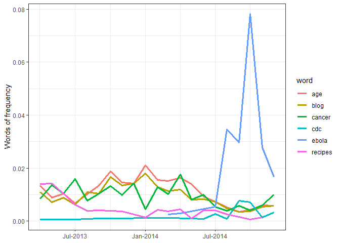<!-- -->

New York time health tweeted a lot about the Ebola which was an outbeak
during the last of 2013.

``` r
words_by_time %>% 
  inner_join(top_slopes, by = c("word", "newsgroup")) %>% 
  filter(newsgroup == "reuters_heatlth") %>% 
  ggplot(aes(time_floor, count/time_total, color = word))+
  geom_line(size = 1.15)+
  scale_x_date(date_labels = "%b-%Y")+
  labs(x = NULL, y = "Words of frequency")
```

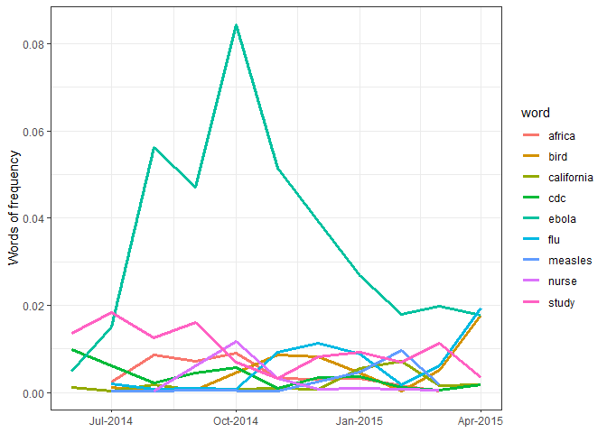<!-- -->

Reuters Health also tweeted alot about the Ebola for long period of
months as compared to the New York time health tweets, as we see from
the graph Reuters tweeted more about “Ebola”.
